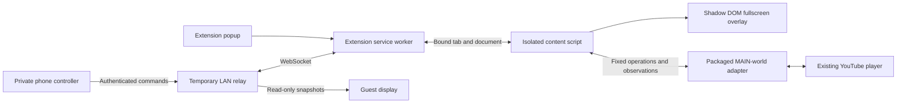

# Gate A prototype

PR: none yet. Status: implemented locally, unmerged; physical-phone acceptance pending. Date: 2026-09-09.

Design: [MVP](../../design/mvp.md). Decisions: [ADR 0001](../../adr/0001-gate-a-temporary-relay.md), [ADR 0002](../../adr/0002-lan-development-invitations.md).

## Current implementation

The repository contains four npm workspaces: a WXT MV3 extension, Vue controller/display fixture with a Node HTTP/WebSocket relay, shared Zod contracts plus an ephemeral playback coordinator, and a Cloudflare Worker/Durable Object deployment target. The prototype now includes an app-owned queue for the same room session.

The extension binds to an explicit watch-page tab/document, injects packaged scripts on attachment, and keeps extension credentials in session storage. The popup displays a private controller QR; the overlay contains a separate view-only QR. Names are rendered as text. Detachment removes listeners and UI.

The adapter probes native player methods, requests an in-place load, and independently observes video identity, load/restart evidence, actual content playback, fullscreen/container preservation, errors, and completion. The coordinator does not announce a singer from command acceptance alone. Pause/resume/skip, intermission, out-of-sync detection, duplicate-command receipts, stale revisions, command timeout, and conservative reconnect behavior are implemented for temporary sessions.

The relay persists nothing: sessions, hashes, receipts, queue items, participant names, and limited diagnostic history live in process memory. Development sessions expire after eight hours. Guests first submit a display name to receive a room-scoped credential; subsequent queue requests derive `requester` from that credential. Host approval changes `pending` requests to `queued`; host reorder validates a complete ordered list and queue revision; `start-next` creates a fresh playback attempt. Credential roles are checked on commands and WebSocket observations; tickets are short-lived and single-use, transmitted in the first WebSocket frame rather than the URL. No backend credential enters the page bridge.

Development uses a shared LAN origin resolver across the extension build, relay, and live test runner. The relay binds to all interfaces, the manifest restricts service access to the chosen origin, and QR captions show the host/port. Explicit origin overrides support multiple adapters and CI. No tunnel exists.

Interfaces are prototype-only `/api/gate/sessions` endpoints (creation, snapshot, commands, ticket, stream, report, close), not the planned production `/api/rooms` API. Controller bearer links are not production host pairing. Existing test sessions are not recoverable after relay restart.

## Verification

Build and strict TypeScript checks pass. All 31 unit/integration tests pass, covering URL normalization, duplicate commands, attribution, stale revisions, timeouts, unknown/ad states, reconnect reconciliation, role separation, expiry, origin checks, LAN selection, guest attribution, approval, queue-driven start, the 30-participant limit, and one-time extension recovery. One controlled-browser test passes, exercising the built extension, separate phone-sized controller browser, fullscreen overlay, duplicate-video attempts, pause/resume, completion, unknown states, untouched unbound tabs, and cleanup. A LAN browser check also verified the join form, named guest credential, and pending queue submission. The fixture is not evidence of YouTube compatibility. Relative file links in all Markdown documents resolve. Application dependencies report zero known npm vulnerabilities; Wrangler remains an external deployment tool rather than a locked application dependency.

The real-site run on Linux with Chromium 153.0.8010.12 and adapter `youtube-native-v0.1.0` confirmed 20 consecutive transitions, including paired identical video IDs, without replacing the player or losing fullscreen/overlay. It also verified pause/resume, skip-to-intermission, actual end observation after seeking near the end, unexpected native-video detection, and unavailable-video blocking. The final unavailable-content snapshot retained fullscreen and had no confirmed singer. See [the recorded run](../gate-a-evidence.md).

Local artifact: `artifacts/gate-a-live.json` (ignored generated diagnostics). Browser scripts use isolated profiles, not the host's normal Google account. Physical-phone QR reachability and the pilot device matrix remain unverified; automated subtests do not certify the entire gate.

## Limitations

The local LAN relay now exposes guest submission, host moderation, queue-driven playback, current/upcoming singer overlay, accessible queue reordering, and extension recovery using a one-time room code. `apps/room-worker` provides the Cloudflare Worker/Durable Object deployment target with SQL-backed room/queue storage, but it is not deployed or covered by live Cloudflare integration tests. The LAN relay still loses rooms on restart; deployed/installable PWA behavior, metadata lookup, and completed Windows/mobile-device validation remain outstanding. CI configuration is present; no remote CI run or PR is claimed.
